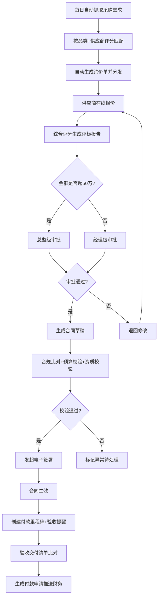
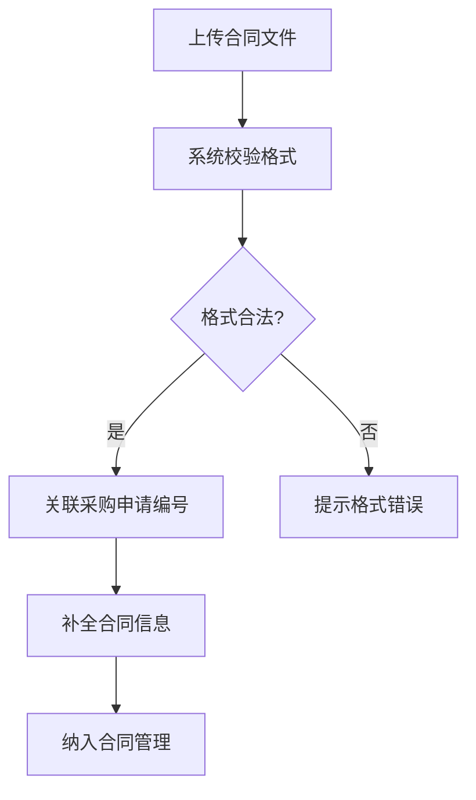

## 1. 产品概述

智能采购管理系统是一套覆盖采购全生命周期的企业级SaaS平台，实现从采购需求抓取、询价分发、供应商报价、评标审批、合同签署、验收付款到数据统计分析的全流程自动化。系统面向中大型企业采购部门，解决传统采购流程中信息孤岛、审批低效、合规风险高、数据不透明等核心痛点，目标是将采购全流程周期缩短40%以上，合规风险降低90%以上。

- 目标用户：企业采购部门、供应商、审批管理层、财务部门
- 核心价值：全流程自动化、智能评标、合规校验、实时预警、数据驱动决策

## 2. 核心功能

### 2.1 用户角色

| 角色 | 注册方式 | 核心权限 |
|------|----------|----------|
| 采购专员 | 管理员分配账号 | 创建询价单、分配供应商、查看评标报告、上传合同 |
| 供应商 | 自主注册+资质审核 | 接收询价、在线报价、查看合同、确认交付 |
| 审批人（经理/总监） | 管理员分配账号 | 审批采购申请、合同审批、超权限上推 |
| 财务人员 | 管理员分配账号 | 处理付款申请、查看付款里程碑、财务对账 |
| 采购经理 | 管理员分配账号 | 查看统计报表、配置预警规则、管理供应商评分体系 |
| 系统管理员 | 系统初始化 | 用户管理、权限配置、合规库维护、系统设置 |

### 2.2 功能模块

1. **工作台首页**：待办事项汇总、采购关键指标卡片、趋势图表、预警通知
2. **采购需求管理**：需求抓取与录入、需求池管理、需求分配与转询价
3. **询价管理**：自动生成询价单、供应商匹配分发、报价回收、综合评分排名
4. **审批中心**：多级审批流程、审批记录追溯、超时预警提醒
5. **合同管理**：合同草稿生成、合规比对校验、电子签署、线下合同上传
6. **验收与付款**：交付清单比对、验收确认、付款申请生成、付款里程碑追踪
7. **统计分析**：采购执行率、响应时长、签约周期、趋势图表、PDF/Excel报告
8. **供应商管理**：供应商信息维护、历史评分体系、资质管理
9. **日志与预警**：全量操作日志、实时预警推送、异常检测

### 2.3 页面详情

| 页面名称 | 模块名称 | 功能描述 |
|----------|----------|----------|
| 工作台 | 待办汇总卡片 | 显示待审批、待报价、待验收数量，点击跳转对应列表 |
| 工作台 | 关键指标卡片 | 采购执行率、平均响应时长、合同签约周期、供应商合格率 |
| 工作台 | 趋势图表 | 近7天/30天采购量趋势、询价响应时长趋势 |
| 工作台 | 预警通知栏 | 超时未审批、报价异常、合同到期等预警信息实时展示 |
| 采购需求列表 | 筛选与搜索 | 按部门、品类、状态、时间范围筛选 |
| 采购需求列表 | 需求卡片 | 显示需求编号、部门、品类、预算、状态、创建时间 |
| 采购需求详情 | 需求信息 | 需求详细描述、规格参数、预算金额、期望交期 |
| 采购需求详情 | 转询价操作 | 选择供应商匹配策略、生成询价单并分发 |
| 询价列表 | 状态筛选 | 待报价、报价中、已截止、已评标 |
| 询价详情 | 询价信息 | 询价单详情、关联需求、截止时间 |
| 询价详情 | 供应商报价对比表 | 各供应商报价、交期、质量评分横向对比 |
| 询价详情 | 综合评分排名 | 价格30%+交期30%+质量40%加权排名，可视化雷达图 |
| 审批中心 | 待审批列表 | 按紧急程度排序，显示金额、申请人、审批层级 |
| 审批详情 | 审批流程图 | 可视化展示当前审批节点、已通过节点、待审批节点 |
| 审批详情 | 审批操作 | 同意/驳回/转审，填写审批意见 |
| 合同列表 | 合同状态筛选 | 草稿、待签署、生效中、已完结、已作废 |
| 合同详情 | 合同信息 | 合同编号、甲乙方信息、金额、关键条款 |
| 合同详情 | 合规比对结果 | 关键条款与合规库比对，标注合规/不合规项 |
| 合同详情 | 签署流程 | 电子签署状态追踪、签署记录 |
| 线下合同上传 | 上传表单 | 上传PDF/图片，系统校验格式，关联采购申请编号 |
| 验收管理 | 验收列表 | 待验收、验收中、已验收 |
| 验收详情 | 交付清单比对 | 采购清单与交付清单逐项比对，标注差异 |
| 验收详情 | 付款申请 | 自动生成付款申请，推送至财务 |
| 付款里程碑 | 里程碑时间线 | 合同付款节点可视化时间线，显示状态（待验收/已申请/已付款） |
| 统计报表 | 采购执行率 | 按部门展示执行率柱状图 |
| 统计报表 | 响应时长分析 | 询价响应时长分布图、平均响应时长趋势 |
| 统计报表 | 签约周期分析 | 从询价到合同签署的周期分布与趋势 |
| 统计报表 | 报告生成与导出 | 生成带趋势图表的PDF/Excel报告，推送至采购经理 |
| 供应商列表 | 供应商信息卡片 | 公司名称、品类、历史综合评分、资质到期提醒 |
| 供应商详情 | 评分详情 | 准时率、合格率、响应时效分项评分及趋势 |
| 供应商详情 | 合作记录 | 历史采购记录、合同列表 |
| 日志查询 | 操作日志列表 | 按时间、操作人、操作类型筛选，支持批量导出 |
| 预警设置 | 预警规则配置 | 配置超时阈值、异常检测规则、推送渠道 |

## 3. 核心流程

### 3.1 采购全流程

每天凌晨系统自动从采购申请系统抓取各部门提交的需求，按品类和供应商历史评分（准时率、合格率、响应时效加权）自动匹配供应商并生成询价单分发。供应商在线报价后，系统基于价格、交期、质量计算综合分生成评标排名报告，触发多级审批流程（超50万需总监级审批）。审批通过后自动生成合同草稿，提取关键条款与合规库比对，校验资金预算和供应商资质，通过后发起电子签署。合同生效后自动创建付款里程碑和验收提醒。验收完成时自动比对交付清单，生成付款申请推送财务。

### 3.2 线下合同上传流程

用户手动上传线下签署的合同PDF/图片，系统自动校验文件格式与完整性，用户关联对应采购申请编号，系统补全合同信息并纳入合同管理。

## 4. 用户界面设计

### 4.1 设计风格

- 主色调：深蓝（#1E3A5F）代表专业可靠，辅助色：琥珀金（#D4A843）代表品质与信任
- 强调色：翠绿（#2D9B83）用于成功/通过状态，珊瑚红（#E05C5C）用于警告/异常状态
- 按钮风格：圆角6px，主按钮实色填充，次按钮描边，hover状态带微妙阴影提升
- 字体：标题使用 DM Sans（粗体600/700），正文使用 Noto Sans SC（常规400），数据数字使用 JetBrains Mono
- 布局风格：左侧固定导航栏 + 顶部面包屑 + 主内容区，卡片式布局，圆角8px
- 图标风格：线性图标（Lucide），1.5px描边，与文字等高对齐
- 背景：浅灰底色（#F8F9FB）配白色卡片，微妙投影层次

### 4.2 页面设计概览

| 页面名称 | 模块名称 | UI元素 |
|----------|----------|--------|
| 工作台 | 待办汇总卡片 | 4列网格卡片，每卡片带图标+数字+环比变化箭头，hover轻微上浮阴影 |
| 工作台 | 关键指标 | 环形进度图+数值，深蓝渐变底色白色文字 |
| 工作台 | 趋势图表 | 面积折线图，深蓝渐变填充，白色网格线 |
| 工作台 | 预警通知 | 左侧红色竖线标识，时间戳+预警内容，可展开详情 |
| 采购需求列表 | 筛选栏 | 顶部水平排列下拉筛选器，搜索框带图标 |
| 采购需求列表 | 需求卡片 | 白色卡片，左侧品类色带，标题+标签+金额，底部状态徽章 |
| 询价详情 | 报价对比表 | 表格横向对比，最优值高亮，表头固定 |
| 询价详情 | 雷达图评分 | 五维雷达图（价格/交期/质量/服务/资质），供应商叠加对比 |
| 审批详情 | 审批流程图 | 横向步骤条，已完成绿色对勾，当前蓝色脉冲动画，待处理灰色 |
| 合同详情 | 合规比对 | 左右对照布局，合规项绿色勾，不合规项红色叉+修复建议 |
| 验收详情 | 交付清单比对 | 双栏对照，匹配项绿色对勾，差异项红色高亮+差异说明 |
| 付款里程碑 | 时间线 | 垂直时间线，节点带状态图标，金额标签，连线颜色表示状态 |
| 统计报表 | 图表区 | 柱状图+折线图+饼图组合，支持时间范围切换 |
| 统计报表 | 导出按钮 | 右上角PDF/Excel导出按钮，带下载图标 |
| 供应商列表 | 供应商卡片 | 卡片含公司Logo占位、名称、评分星级、品类标签 |
| 日志查询 | 日志表格 | 斑马纹表格，操作类型彩色标签，时间精确到秒 |

### 4.3 响应式设计

- 桌面优先设计，最小支持1280px宽度
- 平板适配（768px-1280px）：导航栏折叠为汉堡菜单，卡片从4列调整为2列
- 移动端适配（<768px）：单列布局，表格改为卡片列表，图表简化

### 4.4 3D场景指引

不适用
