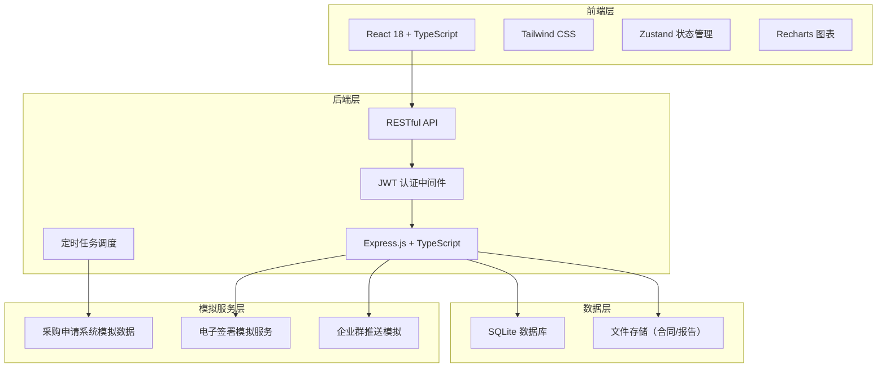
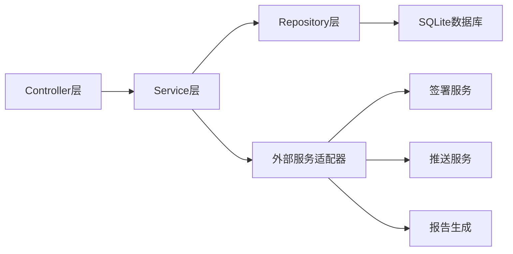
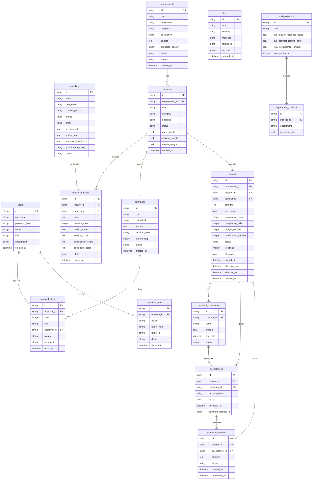

## 1. 架构设计



## 2. 技术说明

- 前端：React@18 + TailwindCSS@3 + Vite + Zustand + React Router DOM
- 初始化工具：vite-init
- 后端：Express@4 + TypeScript（ESM格式）
- 数据库：SQLite（better-sqlite3），使用模拟数据填充
- 图表库：Recharts（趋势图、雷达图、柱状图等）
- 文件处理：multer（文件上传）、pdfkit（PDF报告生成）、exceljs（Excel报告生成）
- 认证：JWT（JSON Web Token）
- 定时任务：node-cron（每日凌晨抓取需求和统计报表）

## 3. 路由定义

| 路由 | 用途 |
|------|------|
| / | 工作台首页，待办汇总、指标卡片、趋势图表、预警通知 |
| /requirements | 采购需求列表，筛选搜索、需求卡片展示 |
| /requirements/:id | 采购需求详情，需求信息、转询价操作 |
| /inquiries | 询价列表，按状态筛选 |
| /inquiries/:id | 询价详情，报价对比、综合评分排名 |
| /approvals | 审批中心，待审批列表 |
| /approvals/:id | 审批详情，审批流程图、审批操作 |
| /contracts | 合同列表，状态筛选 |
| /contracts/:id | 合同详情，合同信息、合规比对、签署流程 |
| /contracts/upload | 线下合同上传页面 |
| /acceptance | 验收管理列表 |
| /acceptance/:id | 验收详情，交付清单比对、付款申请 |
| /payments | 付款里程碑总览 |
| /reports | 统计报表，趋势图表、报告生成与导出 |
| /suppliers | 供应商列表 |
| /suppliers/:id | 供应商详情，评分详情、合作记录 |
| /logs | 操作日志查询，批量导出 |
| /alerts | 预警设置与预警记录 |
| /login | 登录页面 |

## 4. API定义

### 4.1 认证相关

```typescript
interface LoginRequest {
  username: string;
  password: string;
}

interface LoginResponse {
  token: string;
  user: {
    id: string;
    name: string;
    role: "procurement" | "supplier" | "approver" | "finance" | "manager" | "admin";
  };
}
```

### 4.2 采购需求

```typescript
interface ProcurementRequirement {
  id: string;
  title: string;
  department: string;
  category: string;
  description: string;
  specifications: Record<string, string>;
  budget: number;
  expectedDelivery: string;
  status: "pending" | "in_inquiry" | "in_approval" | "contracted" | "completed";
  createdAt: string;
  source: "auto" | "manual";
}

interface RequirementListResponse {
  items: ProcurementRequirement[];
  total: number;
  page: number;
  pageSize: number;
}
```

### 4.3 询价管理

```typescript
interface Inquiry {
  id: string;
  requirementId: string;
  title: string;
  category: string;
  deadline: string;
  status: "draft" | "sent" | "quoting" | "evaluated" | "closed";
  suppliers: InquirySupplier[];
  evaluationResult?: EvaluationResult;
  createdAt: string;
}

interface InquirySupplier {
  supplierId: string;
  supplierName: string;
  historicalScore: number;
  quote?: SupplierQuote;
}

interface SupplierQuote {
  price: number;
  deliveryDays: number;
  qualityScore: number;
  serviceScore: number;
  qualificationScore: number;
  quotedAt: string;
}

interface EvaluationResult {
  rankings: {
    supplierId: string;
    supplierName: string;
    compositeScore: number;
    priceScore: number;
    deliveryScore: number;
    qualityScore: number;
    details: SupplierQuote;
  }[];
  weights: {
    price: number;
    delivery: number;
    quality: number;
  };
}
```

### 4.4 审批管理

```typescript
interface Approval {
  id: string;
  type: "procurement" | "contract";
  relatedId: string;
  amount: number;
  requiredLevel: "manager" | "director";
  currentStep: number;
  steps: ApprovalStep[];
  status: "pending" | "approved" | "rejected";
  createdAt: string;
}

interface ApprovalStep {
  step: number;
  role: "manager" | "director";
  approverId: string;
  approverName: string;
  status: "pending" | "approved" | "rejected";
  comment?: string;
  actedAt?: string;
}

interface ApprovalActionRequest {
  action: "approve" | "reject";
  comment: string;
}
```

### 4.5 合同管理

```typescript
interface Contract {
  id: string;
  requirementId: string;
  inquiryId: string;
  supplierId: string;
  supplierName: string;
  amount: number;
  keyTerms: string[];
  complianceCheck: ComplianceCheckResult;
  budgetVerified: boolean;
  qualificationVerified: boolean;
  status: "draft" | "compliance_checking" | "signing" | "active" | "completed" | "voided";
  isOffline: boolean;
  fileName?: string;
  signedAt?: string;
  effectiveFrom: string;
  effectiveTo: string;
  milestones: PaymentMilestone[];
  createdAt: string;
}

interface ComplianceCheckResult {
  totalChecks: number;
  passed: number;
  failed: number;
  items: {
    clause: string;
    status: "pass" | "fail";
    suggestion?: string;
  }[];
}

interface PaymentMilestone {
  id: string;
  name: string;
  amount: number;
  dueDate: string;
  status: "pending_acceptance" | "accepted" | "payment_requested" | "paid";
}
```

### 4.6 验收与付款

```typescript
interface Acceptance {
  id: string;
  contractId: string;
  milestoneId: string;
  deliveryItems: {
    itemName: string;
    ordered: number;
    delivered: number;
    matched: boolean;
  }[];
  status: "pending" | "in_progress" | "completed";
  acceptedAt?: string;
  paymentRequestId?: string;
}

interface PaymentRequest {
  id: string;
  contractId: string;
  acceptanceId: string;
  amount: number;
  status: "pending" | "processing" | "completed";
  createdAt: string;
  processedAt?: string;
}
```

### 4.7 统计报表

```typescript
interface DailyStatistics {
  date: string;
  departmentExecutionRates: { department: string; rate: number }[];
  avgInquiryResponseHours: number;
  avgContractSigningDays: number;
  totalProcurementAmount: number;
  totalContracts: number;
}

interface ReportGenerationRequest {
  type: "pdf" | "excel";
  dateRange: { from: string; to: string };
  metrics: string[];
}
```

### 4.8 供应商

```typescript
interface Supplier {
  id: string;
  name: string;
  category: string[];
  contactPerson: string;
  phone: string;
  email: string;
  qualificationExpiry: string;
  scores: {
    onTimeRate: number;
    qualityRate: number;
    responseTimeliness: number;
    composite: number;
  };
  scoreHistory: { date: string; composite: number }[];
  status: "active" | "suspended" | "pending_review";
}
```

### 4.9 日志与预警

```typescript
interface OperationLog {
  id: string;
  operatorId: string;
  operatorName: string;
  action: string;
  targetType: string;
  targetId: string;
  detail: string;
  timestamp: string;
}

interface Alert {
  id: string;
  type: "overdue_approval" | "abnormal_quote" | "contract_expiring" | "qualification_expiring";
  severity: "warning" | "critical";
  message: string;
  relatedId: string;
  isRead: boolean;
  createdAt: string;
}
```

## 5. 服务端架构图



## 6. 数据模型

### 6.1 数据模型定义



### 6.2 数据定义语言

```sql
CREATE TABLE users (
  id TEXT PRIMARY KEY,
  username TEXT NOT NULL UNIQUE,
  password_hash TEXT NOT NULL,
  name TEXT NOT NULL,
  role TEXT NOT NULL CHECK(role IN ('procurement','supplier','approver','finance','manager','admin')),
  department TEXT,
  created_at TEXT NOT NULL DEFAULT (datetime('now'))
);

CREATE TABLE requirements (
  id TEXT PRIMARY KEY,
  title TEXT NOT NULL,
  department TEXT NOT NULL,
  category TEXT NOT NULL,
  description TEXT,
  specifications TEXT,
  budget REAL NOT NULL,
  expected_delivery TEXT NOT NULL,
  status TEXT NOT NULL DEFAULT 'pending' CHECK(status IN ('pending','in_inquiry','in_approval','contracted','completed')),
  source TEXT NOT NULL DEFAULT 'auto' CHECK(source IN ('auto','manual')),
  created_at TEXT NOT NULL DEFAULT (datetime('now'))
);

CREATE TABLE suppliers (
  id TEXT PRIMARY KEY,
  name TEXT NOT NULL,
  categories TEXT NOT NULL,
  contact_person TEXT NOT NULL,
  phone TEXT NOT NULL,
  email TEXT NOT NULL,
  on_time_rate REAL NOT NULL DEFAULT 0,
  quality_rate REAL NOT NULL DEFAULT 0,
  response_timeliness REAL NOT NULL DEFAULT 0,
  qualification_expiry TEXT NOT NULL,
  status TEXT NOT NULL DEFAULT 'active' CHECK(status IN ('active','suspended','pending_review'))
);

CREATE TABLE inquiries (
  id TEXT PRIMARY KEY,
  requirement_id TEXT NOT NULL REFERENCES requirements(id),
  title TEXT NOT NULL,
  category TEXT NOT NULL,
  deadline TEXT NOT NULL,
  status TEXT NOT NULL DEFAULT 'draft' CHECK(status IN ('draft','sent','quoting','evaluated','closed')),
  price_weight REAL NOT NULL DEFAULT 0.3,
  delivery_weight REAL NOT NULL DEFAULT 0.3,
  quality_weight REAL NOT NULL DEFAULT 0.4,
  created_at TEXT NOT NULL DEFAULT (datetime('now'))
);

CREATE TABLE inquiry_suppliers (
  id TEXT PRIMARY KEY,
  inquiry_id TEXT NOT NULL REFERENCES inquiries(id),
  supplier_id TEXT NOT NULL REFERENCES suppliers(id),
  price REAL,
  delivery_days INTEGER,
  quality_score REAL,
  service_score REAL,
  qualification_score REAL,
  composite_score REAL,
  status TEXT NOT NULL DEFAULT 'pending' CHECK(status IN ('pending','quoted','declined')),
  quoted_at TEXT
);

CREATE TABLE approvals (
  id TEXT PRIMARY KEY,
  type TEXT NOT NULL CHECK(type IN ('procurement','contract')),
  related_id TEXT NOT NULL,
  amount REAL NOT NULL,
  required_level TEXT NOT NULL CHECK(required_level IN ('manager','director')),
  current_step INTEGER NOT NULL DEFAULT 1,
  status TEXT NOT NULL DEFAULT 'pending' CHECK(status IN ('pending','approved','rejected')),
  created_at TEXT NOT NULL DEFAULT (datetime('now'))
);

CREATE TABLE approval_steps (
  id TEXT PRIMARY KEY,
  approval_id TEXT NOT NULL REFERENCES approvals(id),
  step INTEGER NOT NULL,
  role TEXT NOT NULL CHECK(role IN ('manager','director')),
  approver_id TEXT NOT NULL REFERENCES users(id),
  status TEXT NOT NULL DEFAULT 'pending' CHECK(status IN ('pending','approved','rejected')),
  comment TEXT,
  acted_at TEXT
);

CREATE TABLE contracts (
  id TEXT PRIMARY KEY,
  requirement_id TEXT NOT NULL REFERENCES requirements(id),
  inquiry_id TEXT REFERENCES inquiries(id),
  supplier_id TEXT NOT NULL REFERENCES suppliers(id),
  amount REAL NOT NULL,
  key_terms TEXT,
  compliance_passed INTEGER NOT NULL DEFAULT 0,
  compliance_failed INTEGER NOT NULL DEFAULT 0,
  compliance_details TEXT,
  budget_verified INTEGER NOT NULL DEFAULT 0,
  qualification_verified INTEGER NOT NULL DEFAULT 0,
  status TEXT NOT NULL DEFAULT 'draft' CHECK(status IN ('draft','compliance_checking','signing','active','completed','voided')),
  is_offline INTEGER NOT NULL DEFAULT 0,
  file_name TEXT,
  signed_at TEXT,
  effective_from TEXT NOT NULL,
  effective_to TEXT NOT NULL,
  created_at TEXT NOT NULL DEFAULT (datetime('now'))
);

CREATE TABLE payment_milestones (
  id TEXT PRIMARY KEY,
  contract_id TEXT NOT NULL REFERENCES contracts(id),
  name TEXT NOT NULL,
  amount REAL NOT NULL,
  due_date TEXT NOT NULL,
  status TEXT NOT NULL DEFAULT 'pending_acceptance' CHECK(status IN ('pending_acceptance','accepted','payment_requested','paid'))
);

CREATE TABLE acceptances (
  id TEXT PRIMARY KEY,
  contract_id TEXT NOT NULL REFERENCES contracts(id),
  milestone_id TEXT NOT NULL REFERENCES payment_milestones(id),
  delivery_items TEXT NOT NULL,
  status TEXT NOT NULL DEFAULT 'pending' CHECK(status IN ('pending','in_progress','completed')),
  accepted_at TEXT,
  payment_request_id TEXT
);

CREATE TABLE payment_requests (
  id TEXT PRIMARY KEY,
  contract_id TEXT NOT NULL REFERENCES contracts(id),
  acceptance_id TEXT NOT NULL REFERENCES acceptances(id),
  amount REAL NOT NULL,
  status TEXT NOT NULL DEFAULT 'pending' CHECK(status IN ('pending','processing','completed')),
  created_at TEXT NOT NULL DEFAULT (datetime('now')),
  processed_at TEXT
);

CREATE TABLE operation_logs (
  id TEXT PRIMARY KEY,
  operator_id TEXT NOT NULL REFERENCES users(id),
  action TEXT NOT NULL,
  target_type TEXT NOT NULL,
  target_id TEXT NOT NULL,
  detail TEXT,
  timestamp TEXT NOT NULL DEFAULT (datetime('now'))
);

CREATE TABLE alerts (
  id TEXT PRIMARY KEY,
  type TEXT NOT NULL CHECK(type IN ('overdue_approval','abnormal_quote','contract_expiring','qualification_expiring')),
  severity TEXT NOT NULL CHECK(severity IN ('warning','critical')),
  message TEXT NOT NULL,
  related_id TEXT NOT NULL,
  is_read INTEGER NOT NULL DEFAULT 0,
  created_at TEXT NOT NULL DEFAULT (datetime('now'))
);

CREATE TABLE daily_statistics (
  id TEXT PRIMARY KEY,
  date TEXT NOT NULL UNIQUE,
  avg_inquiry_response_hours REAL,
  avg_contract_signing_days REAL,
  total_procurement_amount REAL,
  total_contracts INTEGER
);

CREATE TABLE department_statistics (
  id TEXT PRIMARY KEY,
  statistic_id TEXT NOT NULL REFERENCES daily_statistics(id),
  department TEXT NOT NULL,
  execution_rate REAL NOT NULL
);

CREATE INDEX idx_requirements_status ON requirements(status);
CREATE INDEX idx_requirements_department ON requirements(department);
CREATE INDEX idx_inquiries_status ON inquiries(status);
CREATE INDEX idx_inquiry_suppliers_inquiry ON inquiry_suppliers(inquiry_id);
CREATE INDEX idx_contracts_status ON contracts(status);
CREATE INDEX idx_contracts_supplier ON contracts(supplier_id);
CREATE INDEX idx_approvals_status ON approvals(status);
CREATE INDEX idx_operation_logs_timestamp ON operation_logs(timestamp);
CREATE INDEX idx_alerts_type ON alerts(type);
CREATE INDEX idx_alerts_is_read ON alerts(is_read);
```
